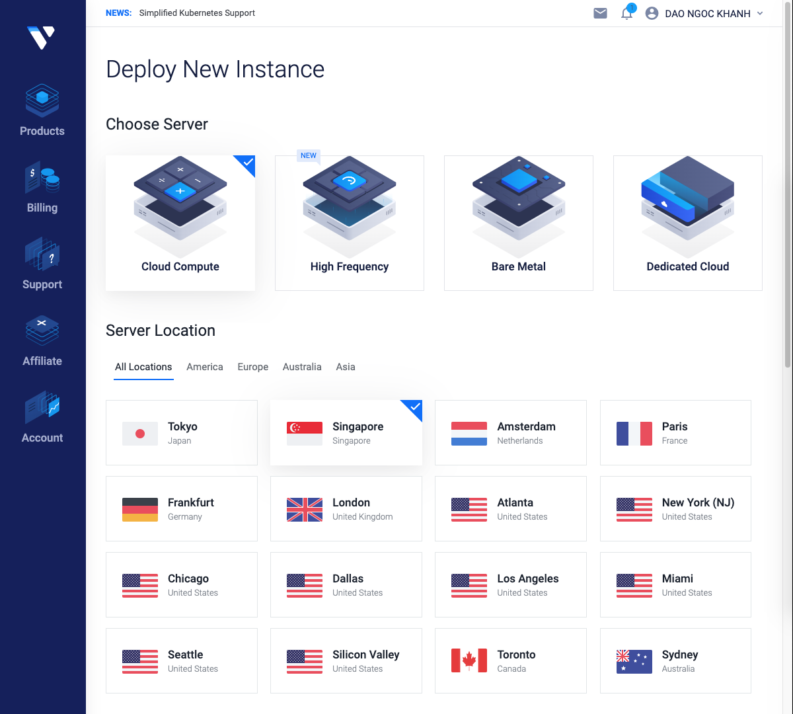

# A Quick Guide to Set Up Tezos Baker on Vultr

\* *Updated: May 2nd, 2020*

##### Table of Contents
[1. Deploy a Clould Instance (Server)](#deployAnInstance)\
[2. Install Tezos Blockchain](#installTezosBlockchain)\
[3. Start Baking Process](#startBakingProcess)

## 1. Deploy a Cloud Instance (Server)

<a name="deployAnInstance"/>

