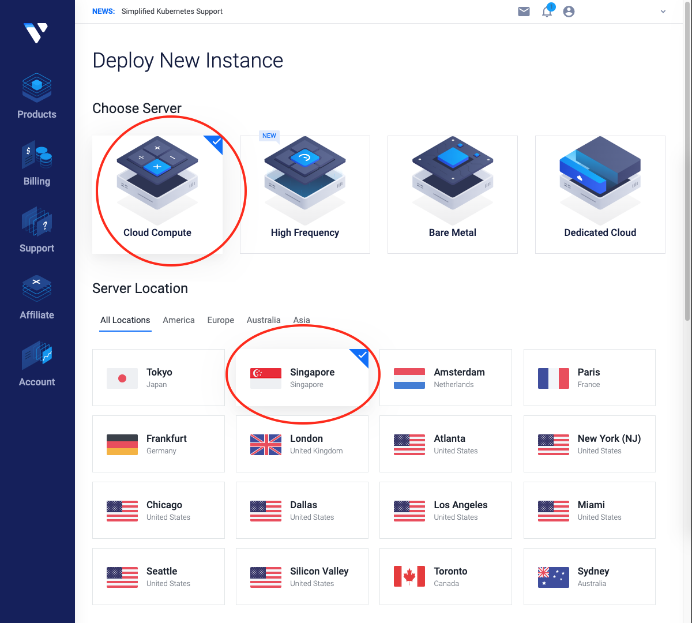

# A Quick Guide to Set Up Tezos Baker on Vultr

#### Disclaimer:

\* *Last Updated: May 2nd, 2020*\
\* *This guide assumes readers have some familiarity with IT system administration (comfortable using command-line in Unix-like environment)*\
\* *TODO: Add more here*

##### Table of Contents
[I. Deploy a Clould Instance (Server)](#deployAnInstance)\
[II. Install Tezos Blockchain](#installTezosBlockchain)\
[III. Start Baking Process](#startBakingProcess)\
[IV. References](#references)

## I. Deploy a Cloud Instance (Server)

<a name="deployAnInstance"></a>

\* *If you have used Vultr to run a server before, skip to **Step 2**.*

**Step 1: Go to https://www.vultr.com/ to register an account, and update billing information**

**Step 2: Login and go to https://my.vultr.com/deploy/ to deploy a cloud instance**

* Choose Server: **Cloud Compute** (general purpose server)
* Choose Server Location: **Singapore** (closest to where you live to get stable remote access)



<br />

* Choose Server Type: **Ubuntu 18.04 x64** (a popular OS)
* Choose Server Size: **80 GB SSD, 2 CPU, 4096MB RAM** (best deal for baking purpose)


<br />

* Leave **Additional Features** as is (all unchecked)
* Add **SSH keys** to gain access from your home computer to this remote server (**Add New** if you have not done before). [Click here for tutorial](https://www.vultr.com/docs/how-do-i-generate-ssh-keys).
* Enter your desired Server **Hostname** and **Label** (eg. `xtzbaker`)
* Click button **Deploy Now** on the bottom right to launch the cloud instance


<br />

* You will be redirected to this page, the status should be **Deploying** or **Running**.
* On the web UI, you can click on the server (`xtzbaker` in this case) to see the **IP Address**. Record this IP Address for frequent future use.
* Also note the password for root user (used in next step). This root password can only be found here on the web UI.


<br />

**Step 3: Test remote access from your home computer**

* Open a terminal, and use ssh to access (you should be on a Unix-like home computer)

```bash
$ ssh root@123.123.123.123 # enter password for `root` obtained from previous step, replace 123.123.123.123 with your server IP Address

# if granted access, you should be inside the remote server command line
root@xtzbaker:~$
```

**Step 4: Create a sudo user for future access & baking**

* Create a sudo user inside the remote server to gain remote access in the future (as well as server priviledges to run baking). [Click here for tutorial](https://www.digitalocean.com/community/tutorials/how-to-create-a-sudo-user-on-ubuntu-quickstart). (eg. a sudo user named `baker`). This user will require a new password during creation.
* You should NOT remotely access **root** user from now on. It's not recommended from security standpoint.
* Once you have a sudo user (eg. `baker`), you can exit the remote server by `CTRL+D` or typing `exit` on server command line, and then test remote access again but this time using the newly created sudo user.

```bash
$ ssh baker@123.123.123.123 # replace `baker` with your created user's name, replace 123.123.123.123 with your server IP Address, type password when prompted

# If access granted, you will be inside the remote server under user `baker`.
# This is the RECOMMENDED remote access from now on.
baker@xtzbaker:~$
```

## II. Install Tezos Blockchain

<a name="installTezosBlockchain"></a>

\* *For demo convenience, sudo user `baker` and hostname `xtzbaker` will be used in the following commands.*

**Step 1: Access to Vultr remote server from your home computer**

```bash
ssh baker@<IP_ADDRESS> # type password when prompted
```

**Step 2: Install necessary libraries to build & run Tezos blockchain from source code**

```bash
# Copy and paste one by one each command below
# Type password for user `baker` if prompted

sudo apt-get update

sudo apt-get upgrade

sudo apt install -y rsync git m4 build-essential patch unzip bubblewrap wget pkg-config libgmp-dev libev-dev libhidapi-dev which

wget https://github.com/ocaml/opam/releases/download/2.0.3/opam-2.0.3-x86_64-linux

sudo cp opam-2.0.3-x86_64-linux /usr/local/bin/opam

sudo chmod a+x /usr/local/bin/opam
```

**Step 3: Download Tezos blockchain source code**

```bash
# Copy and paste one by one each command below

git clone https://gitlab.com/Tezos/Tezos.git

cd Tezos

git checkout mainnet
```

**Step 4: Build Tezos blockchain from source code**

```bash
# Copy and paste one by one each command below
# Each command below may take a while to complete

opam init --bare # you should be asked 2 questions at this step, both answers should be N (No)

make build-deps

eval $(opam env)

make
```

**Step 5: Set up Tezos environment for future use (baking)**

```bash
export PATH=~/Tezos:$PATH

source ./src/bin_client/bash-completion.sh

sudo echo 'export TEZOS_CLIENT_UNSAFE_DISABLE_DISCLAIMER=Y' >> ~/.bashrc # Remove repeated disclaimer message whenever interacting with Tezos command line

source ~/.bashrc
```

## IV. References

[1] [Tezos official docs (https://tezos.gitlab.io/index.html)](https://tezos.gitlab.io/index.html)\
[2] [Tezos Southeast Asia tutorial (https://www.tezos.org.sg/the-berry-good-guide-to-setting-up-tezos-node-baker-using-raspberry-pi-ubuntu/)](https://www.tezos.org.sg/the-berry-good-guide-to-setting-up-tezos-node-baker-using-raspberry-pi-ubuntu/)
