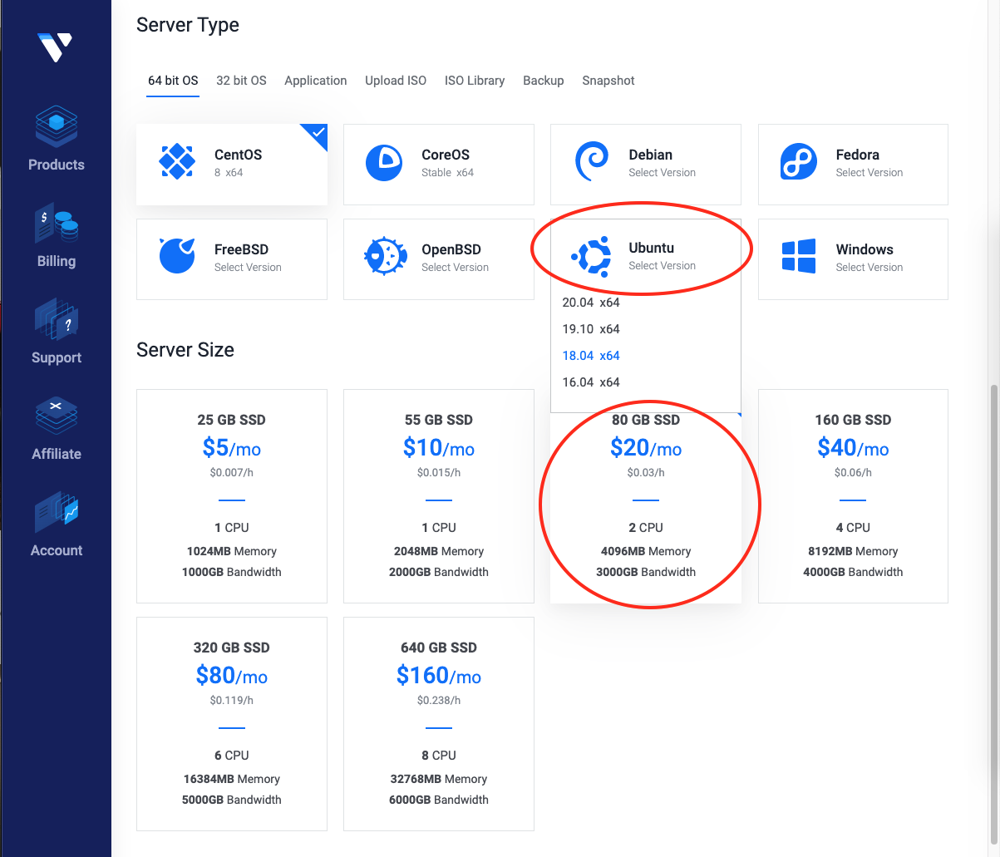
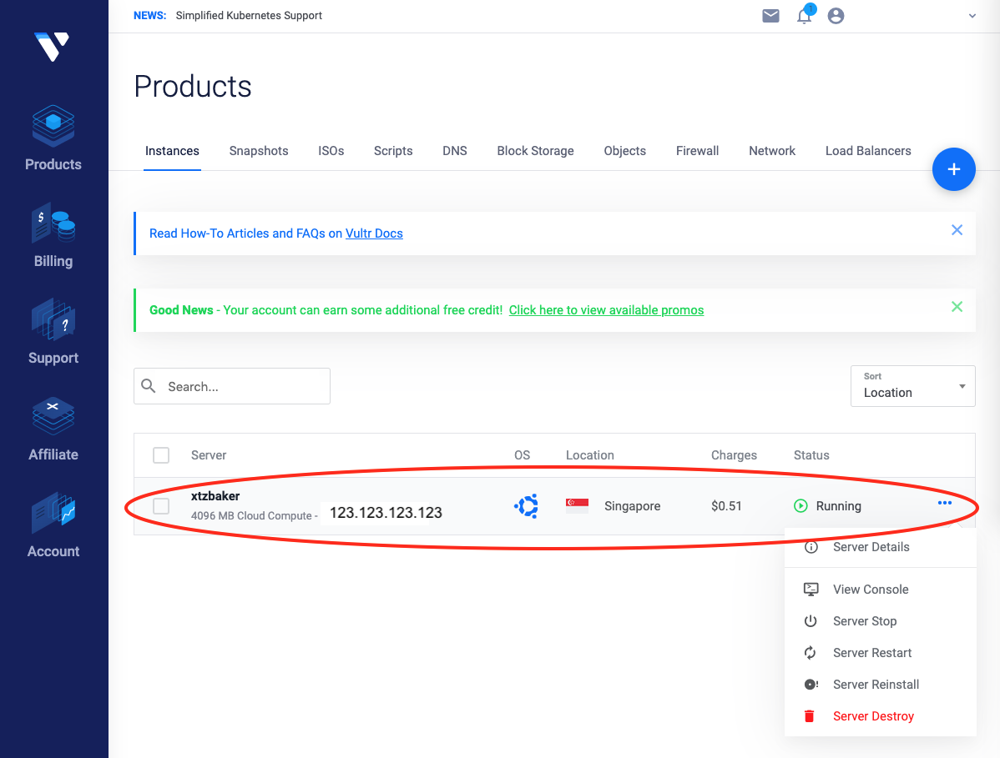

# A Quick Guide to Set Up Tezos Baker on Vultr

\* *Updated: May 2nd, 2020*

\* *This guide assumes readers have some familiarity with IT system administration (comfortable using command-line in Unix-like environment)*

##### Table of Contents
[I. Deploy a Clould Instance (Server)](#deployAnInstance)\
[II. Install Tezos Blockchain](#installTezosBlockchain)\
[III. Start Baking Process](#startBakingProcess)\
[IV. References](#references)

## I. Deploy a Cloud Instance (Server)

<a name="deployAnInstance"></a>

If you have used Vultr to run a server before, skip to **Step 2**.

**Step 1: Go to https://www.vultr.com/ to register an account, and update billing information**

**Step 2: Login and go to https://my.vultr.com/deploy/ to deploy a cloud instance**

* Choose Server: **Cloud Compute** (general purpose server)
* Server Location: **Singapore** (closest to where I live to get stable remote access)


* Server Type: **Ubuntu 18.04 x64** (a popular OS)
* Server Size: **80 GB SSD, 2 CPU, 4096MB RAM** (best deal for baking purpose)



* Leave Additional Features as is **(all unchecked)**
* Add **SSH keys** to gain access from your home computer (laptop) to this remote server (**Add New** if you have not done before). [Click here for tutorial](https://www.vultr.com/docs/how-do-i-generate-ssh-keys).
* Enter your desired Server **Hostname** and **Label** (eg. xtzbaker)
* Click button **Deploy Now** on the bottom right to launch the cloud instance


* You will be redirected to this page, wait until status is **Running**.
* While status is still **Running**, you can click on the server to see the **IP Address**. Record this IP Address for frequent future use.
* Also note the password for root user (used in next step).



**Step 3: Test remote accessing from your home computer (laptop)**

* Open a terminal and accessing using ssh (assuming you are on a Unix-like home computer)

```bash
ssh root@<IP_ADDRESS>

# You will be prompted to enter password. Enter the password from above.
# If access granted, you will be inside the remote server command line.
```

**Step 4: Create a sudo user for future remote access & running baking**

* Once you are in the remote server, create a sudo user that you will gain remote access in the future and have priviledges to run baking. [Click here for tutorial](https://www.digitalocean.com/community/tutorials/how-to-create-a-sudo-user-on-ubuntu-quickstart). (eg. a sudo user named `baker`). This user will require a new password during creation.
* You should NOT remotely access **root** user from now on. It's not recommended from security standpoint.
* Once you have a sudo user (eg. `baker`), you can exit the remote server by `CTRL+D` or typing `exit` on server command line, and then test remote access again but this time using the newly created sudo user.

```bash
ssh baker@<IP_ADDRESS> # replace `baker` with your created user's name

# You will be prompted to enter password for this sudo user `baker`.
# If access granted, you will be inside the remote server command line under user baker.
# This is the RECOMMENDED remote access from now on.
```

## IV. References

[1] [Tezos official docs (https://tezos.gitlab.io/index.html)](https://tezos.gitlab.io/index.html)